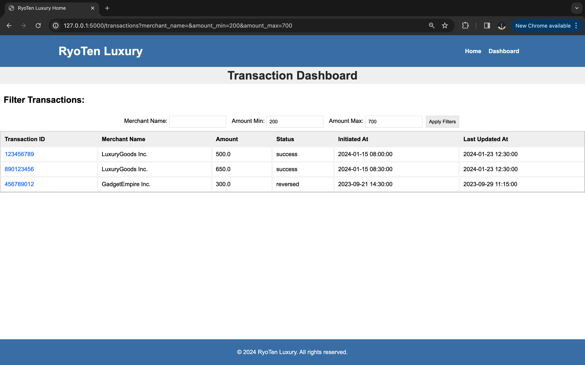

# RyoTen-BERT-LABS
# RyoTen Luxury Website

This repository contains the source code for the RyoTen Luxury website, a web application built using Flask and MongoDB. The website serves as an admin console for managing transactions.

## Table of Contents

- [Features](#features)
- [Prerequisites](#prerequisites)
- [Installation](#installation)
- [Configuration](#configuration)
- [Usage](#usage)
- [Features with pictures](#features-with-images)
- [Video link](#video-link)


## Features

- Dashboard for viewing and managing transactions.
- Transaction details page with a timeline view.
- Filters for transactions based on merchant name and amount range.
- Summary graph/chart of transactions for the RyoTen Lux Product Team.

## Prerequisites

Before you begin, ensure you have the following installed:

- Python 3.x
- MongoDB
- Flask (install using `pip install Flask`)
- Pymongo (install using `pip install pymongo`)

## Installation

1. Clone the repository:

    ```bash
    git clone https://github.com/your-username/ryoten-lux-website.git
    ```

2. Change into the project directory:

    ```bash
    cd ryoten-lux-website
    ```

3. Install dependencies:

    ```bash
    pip install -r requirements.txt
    ```

## Configuration

1. **Set up a MongoDB database:**

    - Ensure you have MongoDB installed and running.

    - Open MongoDB Compass or use the MongoDB shell to create a new database.

    ```bash
    use RyoTenLux
    ```

    - Create a collection named `transactions`:

    ```bash
    db.createCollection("transactions")
    ```

2. **Update MongoDB Connection String in `server.py`:**


3. **Specify Collection Name:**

    - If you have chosen a different name for the MongoDB collection, update the `transactions_collection` variable in the `server.py` file.

    ```python
    transactions_collection = db["your_collection_name"]
    ```

    - Replace `"your_collection_name"` with the actual name of your MongoDB collection."
    ```


## Usage

1. Run the Flask application:

    ```bash
    python server.py
    ```

2. Open your browser and navigate to [http://localhost:5000](http://localhost:5000) to access the RyoTen Luxury website.


## features-with-images

- **Home Page:**
  - Displays a quick summary graph/chart of transactions for respective merchants and users.
  - 

- **Dashboard Page:**
  - Provides a list of transactions with details, including transaction ID, merchant name, amount, status, initiated at, and last updated at.
  - Supports filters for merchant name (partial matches) and amount range.
  - 

- **Merchant-Name Filter:**
  - In the dashboard, you can filter transactions by entering a partial or full merchant name.
  - 

- **Amount-Range Filter:**
  - In the dashboard, you can filter transactions based on the amount range, specifying minimum and maximum amounts.
  - 

- **Name-Amount Filter:**
  - In the dashboard, you can combine filters to search for transactions based on both merchant name and amount range.
  - 

- **Transaction-Details:**
  - Clicking on a transaction ID in the dashboard leads to a detailed view page.
  - The detailed view includes a timeline of the transaction's status, resembling a courier package tracking timeline.
  - 

## video-link
[Drive Link](https://drive.google.com/file/d/1LKAowZ2y2HPSsMilDlXtkbiLbLzboNdd/view?usp=sharing)


